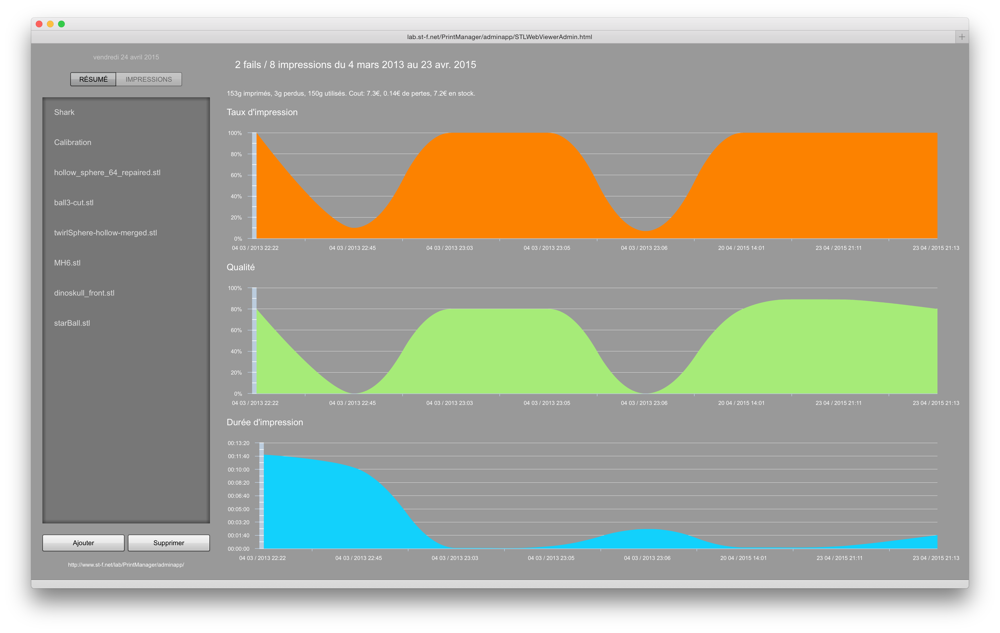
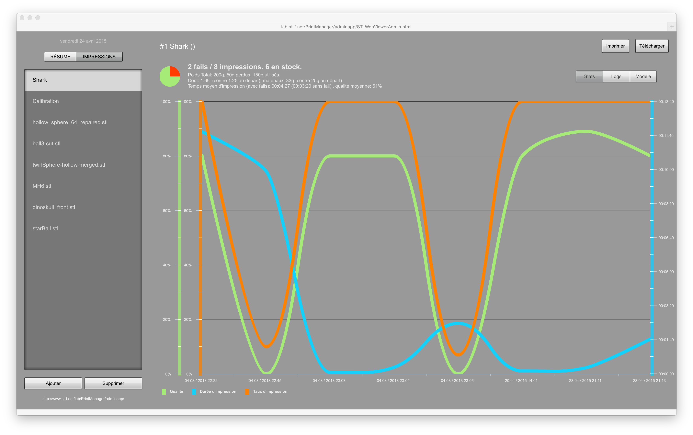
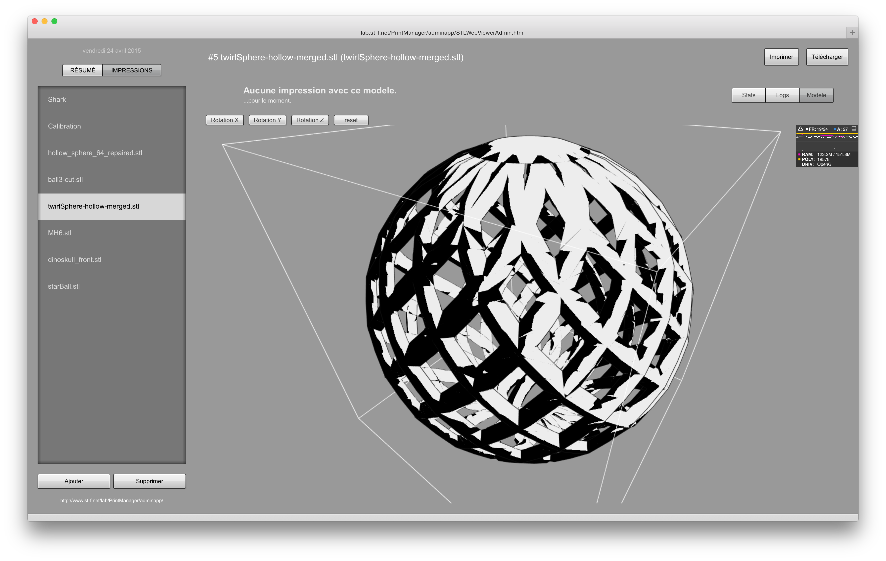

# 3DPrinterMonitor
A website to monitor a 3D printer activity 
---------------------------------------

Creation date: 04/2010

Requirements :

- PHP 5.5 with Zend Framework (see Lab repo) and MySQL
- Flex 4.6 with RTMP

Functionalities :

- Using a camera (I'm using an iPevo presenter document camera), takes a snapshot every 5s during the impression, and generates a timelapse video that can be viewed on the site. An RTMP connection is then open, allowing all visitors to view the progress of a print in real time, using P2P.
- Shows the time taken by each print, as well as the weight of material and the cost.

User's manual : 
---------------
1. Connect a camera via USB
2. Go to http://lab.st-f.net/3DPrintMonitor

Developer's manual
-----------------
1. Install Flash Builder 4.6 Premium
2. Make sure the Lab repo is checked out and this repo folder is included inside the Lab repo (the Lab's .gitignore contains 3DPrintMonitor). 

Screenshots
--------------

