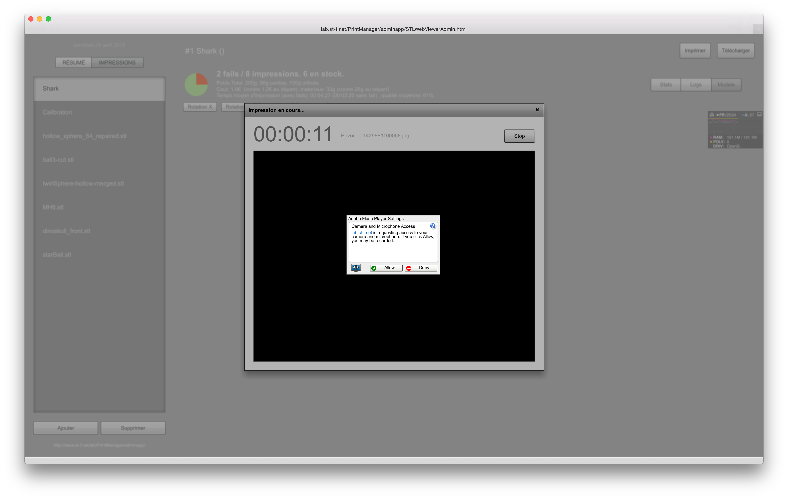

# 3DPrinterMonitor
A website to monitor a 3D printer activity 
---------------------------------------

**Creation date:** 04/2010

**Development time:** 2 weeks

**Tools:**

- PHP 5.5 with Zend Framework (see Lab repo) and MySQL
- Flex 4.6 with RTMP

**Functionalities**

- Using a camera (I'm using an iPevo presenter document camera), takes a snapshot every 5s during the impression, and generates a timelapse video that can be viewed on the site. An RTMP connection is then open, allowing all visitors to view the progress of a print in real time, using P2P.
- Shows various stats such as fail rate, quality, time taken per print, as well as weight of material used and cost.
- Previews the STL file using Away3D

**User's manual : **

1. Connect a camera via USB
2. Go to http://lab.st-f.net/3DPrintMonitor

**Screenshots**

